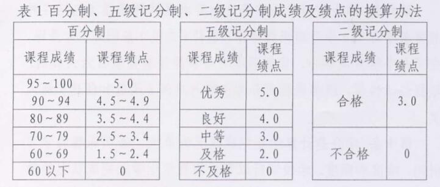

## 成绩与学分

### 课程成绩

课程考核分为`考试`和`考察`两种，由培养计划规定。课程成绩由平时成绩和期末考核成绩综合评定。

不合格者需**补考或重新学习**,成绩合格后才能取得学分。

旷课累计学时或缺交作业累计量超过**三分之一**，取消考核资格，成绩按“0”分记。

### 补考

必修类课程和限选类课程(非实践性教学环节)考核不及格者,可以参加一次补考,补考后不及格者须重新学习该门课程。**任选类课程、课外必修项目、实践性教学环节**一般不设补考,不及格须重新学习。

补考成绩60分以上按**60分**(五级制即合格)记载，60分以下按实记载(五级制即不合格)。

### 学分

学分是计算学业完成状况的单位,表明课程的学习时间、难度和强度。学生按要求参加课程学习的全过程,课程成绩达到**60分、及格或合格**以上即获得该课程的学分。各门课程相应的学分详见各专业的培养计划。

### 绩点（GPA）

学校采用平均学分绩点(GPA)衡量学生的学习质量。平均学分绩点是学生所学过的备门课程绩点的加权平均值(按学分加权)。

`平均学分绩点`=`有效课程学分绩点总和`÷`有效课程学分总和`

`课程学分绩点`=`课程绩点`x`课程学分`

## 免修与免听

免修和免听申请均规定在开学**两周内**提出。

思想政治理论课(含实践课)、体育课、各种实验课和实践性教学环节等以过程性考核方式考核的课程,不得免修和免听。

### 免修

学生通过自学已掌握某门未选的课程，并已取得该课程的先修课程的学分，且前两个学期的**平均学分绩点≥3.5**，可在开学两周内由本人提出免修考核申请，批准备案后参加该课的免修考核，合格即获得学分，此学分视为选课修读考核合格获得学分。

[免听申请表](免听申请表.doc)(仅供参考，请以教务处网站最新版本为准)

### 免听

前两个学期**学分绩点≥3.0**或**已修过**该课程的学生，可在开学两周内提出免听申请，批准后可免听进行自学；免听学生须完成作业，参加实验、上机并参加统一考核，合格即获得课程学分。

注：思想政治理论课（含实践课）、体育课、各种实验课等以过程性考核方式考核的课程，**不得免修和免听**。

----------

## 转专业(类)

以下内容根据`杭电本[2017]180号`[《杭州电子科技大学转专业(类)与大类分流实施办法（试行）》][2]整理。

此办法自**2017级**本科生起开始实施。

注意，文件第三条说明了六种可申请转专业情况，我们仅说明了最常见的**第一种情况**。

### 对象

- 一年级在校学生：可申请在全校已有的专业(类)范围内选择专业(类)；
- 二年级第一学期在校学生可申请在同一学科门类中已有的专业(类)范围内选择专业(类)。
- 文件另外规定了八种**不允许转专业(类)**的情况

### 程序

- 各学院在每学期第13周前，上报拟定接收转入学生人数计划，批准后公布。
- 每学期末，学生根据“转专业通知”，在学校[转专业网站][3]（可能需要校园网）提交电子申请，可同时填报**2个志愿**。
- 转专业投档成功后，在公示期间，学生可提出放弃转专业的申请；放弃转专业的学生在校期间**不得再次**提出转专业申请。
- 学校在下一学期初,参照**平行志愿**投档和录取方法,在转专业网站进行投档录取,并将投档成功的学生名单在教务处网站进行公示。

注：

- 若申请转入专业的人数超过该专业公布的接收人数，对全校申请该专业的入同一年级同一专业(类)的学生按**绩点排名比**排序的原则,从小到大依次录取。
- 绩点排名比=`学生的平均学分绩点(GPA)在年级专业(类)排名`÷`所在年级专业(类)的总人数`
- 按照大类招生的专业(类)，如学生转入时,学院已经完成大类分流的,仍直接录取到大类,由学院再进行大类分流。
- 公示期结束后，学校不再受理转回原专业的申请。

## 大类分流

大类分流是指学生在专业大类所包含的专业范围内进行专业分流,大类分流工作分两个阶段,即**专业预分流**与**专业确认**。

### 时间

原则上在学生入学后**第二学期或第三学期第10周前**,学院组织学生完成专业**预分流**工作。

按类招生的学生原则上应于入学后**第四学期第10周前**,由学院组织完成专业确认工作,并将确认后的学生名单在学院网站进行公示1周。经专业确认后,所选专业**不得再次更改**。

## 辅修专业与修读第二专业

### 修读要求

在不影响主修专业学习的前提下，遵循跨学科、跨门类原则，选择与主修专业不在同一学院或同一个二级类的专业。

### 申请修读与退读程序

符合要求的学生，入学后可在第二、三、四、学期末学校规定的时间内提出申请，在对应的下一学期，学校批准后可根据培养计划与自身情况选修课程。若中途放弃，则在每学期开学后3周内办理退读手续，按选课相关规定退选相关课程，已选课程成绩将计入平均学分绩点。

## 课程替代与学分认定

以下内容按照`杭电本[2018]37号`[《杭州电子科技大学本科学生课程替代与学分认定管理办法 (试行)》][1]整理。
**内容仅供参考，请以文件原文和相关部门解释为准。**

[课程替代申请表](课程替代申请表.doc)(仅供参考，请以教务处网站最新版本为准)

### 重点关注

1. 课程替代以课程教学内容及考核要求相同或相近为基本原则,替代课程与被替代课程在**课程性质**、**课程内容**、**教学要求**等方面具有一致性,可申请课程替代。

2. 原则上必修课可以替代选修课,选修课不能替代必修课。

3. 课程学分替换时,课程名称、内容和考核方式相同的课程,其学分和课程性质高于或者等同于被替代课程或相差**0.5**学分,可以进行课程学分替代;课程内容相同或者相近 (通识选修课除外)且已修课程学分低于替代课程教学要求1个学分(含)以内,若已修课程课程绩点>2.5(即课程成绩>70分或课程成绩中等以上),则可以**降10分**或降档进行课程替代。

----------

## 学业警示与退学

### 退学警示

退学警示.学生一学期(已进入毕业设计与论文环节的学生、学生休学学期除外)修读培养计划规定的有效课程所获得的学分,同时满足(一)和(二)两个条件或(三)条件的,将给予退学警示。

1. 当学期修读培养计划规定的有效课程所**获得**的基本学分小于14学分(不含公共体育课、课外教育项目,其中任选类课程学分不超过4学分)
1. 入学以来平均每学期所获得有效课程的学分小于18学分;
1. 延长学习年限学生一学期获得有效课程的学分为零。

退学警示**每学期**进行一次,由学生所在学院在开学后五周内统计出给予退学警示的学生名单,签发“退学警示通知书”。

### 退学

学生有下列情形之一的,予以退学处理:

1. 在读期间**连续2次**或**累计3次**受到退学警示的;
1. 在学校规定的最长修业年限内(含休学)未完成学业的;
1. 每学期开学后,未请假或请假未批准逾期两周以上未注册者;
1. 休学期满,在两周内未提出复学申请或申请复学经复查不合格者;
1. 未请假离校连续两周未参加学校规定的教学活动者;
1. 经学校指定医院诊断,患有疾病或者意外伤残无法继续在校学习的;
1. 应征入伍的学生超过保留学籍的最长年限,未办理恢复学籍手续的。
1. 达到标准修业年限,却未达到毕业或结业要求的学生,若在规定的时间内未申请办理延长学年手续,视为放弃延长学年;
1. 其它应予退学的情形。

----------

## 培养方案

培养方案为**印刷版定稿**，若专业学院在执行过程中对培养方案进行调整，调整后的内容将及时更新至教务系统，学生可至“选课系统-信息查询-培养计划“中进行查询，毕业审核以调整后的培养方案为准。

- [2017级公办本科各专业培养方案](http://i.hdu.edu.cn/dcp/forward.action?path=/portal/portal&p=pimHomePage#%23m%3Dpim%26t%3Dpd%26ptt%3Dd%26ptc%3D12988%26pt%3D%26pd%3D%26ps%3D%26psh%3D)

- [2016级公办本科各专业培养方案](http://i.hdu.edu.cn/dcp/forward.action?path=/portal/portal&p=pimHomePage#%23m%3Dpim%26t%3Dpd%26ptt%3Dd%26ptc%3D9831%26pt%3D%26pd%3D%26ps%3D%26psh%3D)

- [2015级培养方案](http://i.hdu.edu.cn/dcp/forward.action?path=/portal/portal&p=pimHomePage#%23m%3Dpim%26t%3Dpd%26ptt%3Dd%26ptc%3D7508%26pt%3D%26pd%3D%26ps%3D%26psh%3D)

- [2014级本科生培养方案](http://i.hdu.edu.cn/dcp/forward.action?path=/portal/portal&p=pimHomePage#%23m%3Dpim%26t%3Dpd%26ptt%3Dd%26ptc%3D5290%26pt%3D%26pd%3D%26ps%3D%26psh%3D)

[1]: http://i.hdu.edu.cn/dcp/forward.action?path=/portal/portal&p=pimHomePage##m=pim&t=pd&ptt=d&ptc=13527&pt=&pd=&ps=&psh=
[2]: http://i.hdu.edu.cn/dcp/forward.action?path=/portal/portal&p=pimHomePage#%23m%3Dpim%26t%3Dpd%26ptt%3Dd%26ptc%3D11741%26pt%3D%26pd%3D%26ps%3D%26psh%3D
[3]: http://zzy.hdu.edu.cn