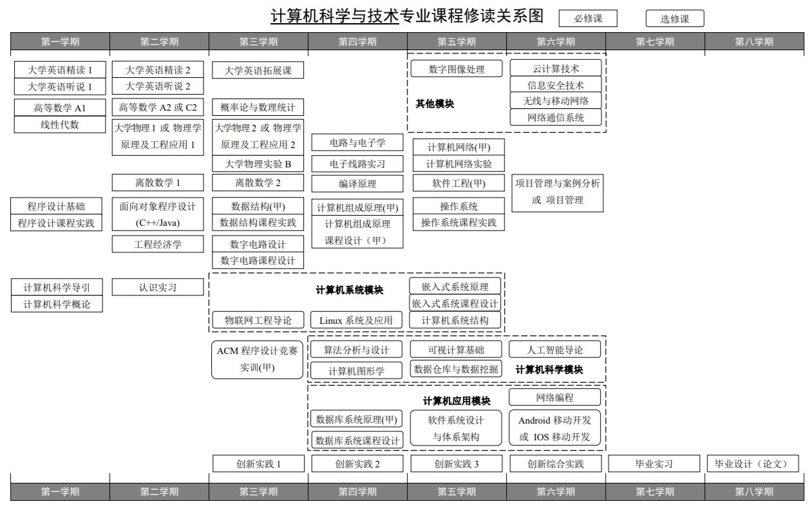
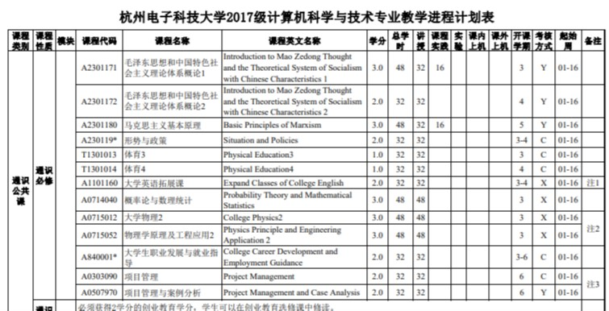

## 培养方案

下列培养方案为**印刷版定稿**。

若在执行过程中进行调整，调整后的内容将及时更新至教务系统，可至“选课系统-信息查询-培养计划“查询。

- [2017级公办本科各专业培养方案](http://i.hdu.edu.cn/dcp/forward.action?path=/portal/portal&p=pimHomePage#%23m%3Dpim%26t%3Dpd%26ptt%3Dd%26ptc%3D12988%26pt%3D%26pd%3D%26ps%3D%26psh%3D)

- [2016级公办本科各专业培养方案](http://i.hdu.edu.cn/dcp/forward.action?path=/portal/portal&p=pimHomePage#%23m%3Dpim%26t%3Dpd%26ptt%3Dd%26ptc%3D9831%26pt%3D%26pd%3D%26ps%3D%26psh%3D)

- [2015级培养方案](http://i.hdu.edu.cn/dcp/forward.action?path=/portal/portal&p=pimHomePage#%23m%3Dpim%26t%3Dpd%26ptt%3Dd%26ptc%3D7508%26pt%3D%26pd%3D%26ps%3D%26psh%3D)

- [2014级本科生培养方案](http://i.hdu.edu.cn/dcp/forward.action?path=/portal/portal&p=pimHomePage#%23m%3Dpim%26t%3Dpd%26ptt%3Dd%26ptc%3D5290%26pt%3D%26pd%3D%26ps%3D%26psh%3D)

### 阅读重点

*以《2017级计算机科学与技术专业培养方案》为例*

#### 学分分配和最低毕业学分要求

这里值得注意的是最低毕业学分要求。在培养计划下面会也说明。

#### 有关说明

双语教学、可选课程、必选课程等备注是需要注意的。

#### 修读关系图

有的专业有模块、方向的划分，请务必注意相关要求。

#### 教学进程计划表

这是我们需要关注的重点部分。可以进行批注或做成Excel，标注我们的完成情况。