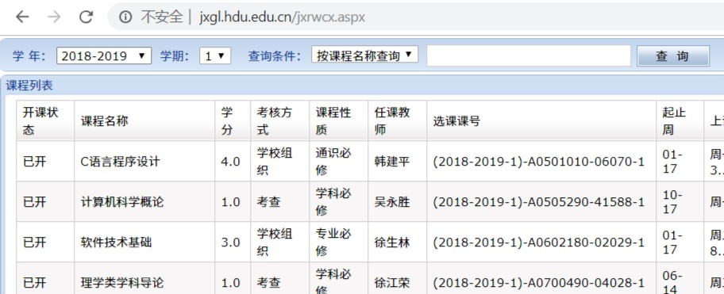

## 选课

### 概述

在大学生活中，选课是灰常重要哒。一门好的课、一位好的老师，是大家所期望的。那么，肿么正确地选课呢？

### 入门

就选课来说，教务系统有这么几栏：

- 选普通理论及实践课：大部分必修课都在这选哒
- 选体育课：大一大二的童鞋要修体育课。其中大一上的体育课应该已经预选。
- 选实践课
- 通识选修课：选创新创业、通识、心理等一大堆课的地方，一般抢这里哒课。
- 学生选课情况查询：看自己已经选了什么课。

### 选前准备

选课前一周,~~为了预习~~就可以做准备了。

首先，是阅读**选课通知**。选课通知中有时间安排、提示等重要信息，千万要注意。

其次，是**了解**自己要修的课程。

- 培养计划：推荐教务系统中的培养计划，也可以纸质的。如有变化，教务系统中会及时更新。

- 学生个人课表：信息查询中的这个选项，可以通过选择下学期来提前看已经预选的课。

- [教学任务查询](http://jxgl.hdu.edu.cn/jxrwcx.aspx)：查看开课情况的利器。注意要点击`查询`而不是回车哦。

其次，是**规划**课表。

建议通过Excel对课程进行安排，记录课程可选时间，规划选课策略。

对可选课程进行颜色标记，有助于择优安排。

### 选课

首先，需要一个较好的网络。机房、闪讯等有线的校园网络是最好不过的，其次是i-HDU等无线网络。~~据说3教6楼网络中心门口会有好多童鞋。~~

选课的第一步，是**提前**登陆教务系统，并不时**刷新**防止超时。根据经验，选课开始时，数字杭电、统一登陆甚至是i-HDU认证可能会打开缓慢。

其次，就是选择课程。按惯例，一般先选通识选修课，傍晚时才可以选其他课程。选修课、体育课可以考虑使用HduIn抢课。

### 捡漏

如果没抢到心仪的课程，不用灰心，还有机会。

一般会有这么几个时间点：

- 可以跨年级、跨专业的第二轮选课开始时
- 第二学期开学后
- 转专业结果公布、专门选课时间结束时

当然，寒暑假不时刷选课系统，可能有意想不到的收获。

### 备注

- 可以使用物原代替大雾的童鞋一定要试试看。
- 注意实践教学环节有无课程要选。
- 记得修读修读创业教育学分。
- 校际选修课等特殊课程会提前结束，无法退课。